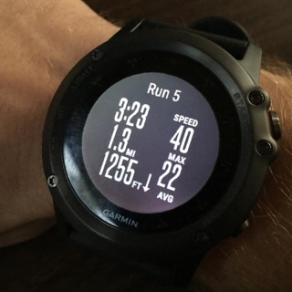
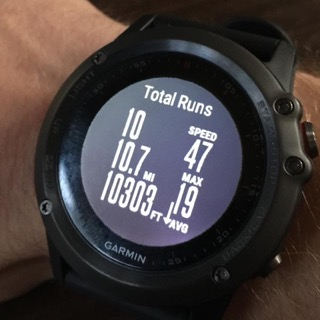

## Garmin Fenix 3: First Impressions

---
tags:
- wearables
- fitness
- smart watch
- garmin
- watches
- technology
- review
---

<!-- preview -->
For the past year or so I've been wearing a Pebble smart watch. I was never really interested in watches as fashion  accessories but more as functional devices. With the rise of cell phones, I never saw the need to carry a second time telling device.  The Pebble brought a new level of convenience  and functionality to the table that a phone didn't. The Pebble's been great for the past year but it was getting a little dated and I think it was just time to move on.

A few days ago I got my hands on a Garmin Fenix 3 Multisport watch. I won't get into the nitty gritty about everything this watch can do. For that, you should read [DC Rainmaker's in depth Fenix 3 review](http://www.dcrainmaker.com/2015/03/garmin-fenix3-detailed-review.html). I'll just breifly touch on things I like and don't like.
<!-- /preview -->

## Things I Like

### Design: much better looking than a Pebble
The original Pebble was all about function over fashion. The Fenix 3 is a much classier looking watch. It just looks better on my wrist in every way.

### Battery Life
I charged the watch to 100% on Friday the 13th. On the morning of Saturday the 21st the watch was down to 13%. This includes about 3 hours and 15 minutes of GPS usage while on bike rides and a 30 minute lap swim. I was hoping to do a little better than that on battery life but I'm still pleased.

### Workout Recording
This works as about as expected (very well) relative to my 910xt.

### Ski/Board Tracking
The Fenix 3 comes with a ski/board "app" built in. I figured it would just track my GPS location throughout the day and not much else. I was pleasantly surprised at how well it tracked my boarding session. The watch will automatically count your runs for you. It knows when you get on the lift and when you're riding. I was out snowboarding today for about ~2 hours and in that time took about 8 runs. The watch will show you the distance, vertical feet, average speed, and max speed for each run in addition to totals for all runs.

 

### Connect IQ
Connect IQ is garmin's SDK for developing watch apps, widgets, watch faces, and custom data fields. I've already dived in and released a [watch face](https://apps.garmin.com/en-US/apps/2e20cdd8-9a50-4819-9218-54e3b65160b2).

### Auto-sync over bluetooth
I love that activities are automatically synced over bluetooth. Before this I would record workouts with either my Garmin Forerunner 910xt or Garmin Edge 500. The 910xt synced activities over ant+. This required plugging in the ant+ stick, opening Garmin Ant Agent on my computer. The Edge 500 required plugging it into the computer with a USB cable. The other day I a swim workout at the pool. After finishing my swim, I went to the locker room and hopped into the shower for a quick rinse. Before getting out of the shower, the Fenix 3 had linked with my phone in a near by locker and uploaded my activity to Garming Connect.

### Activity Tracker Move Bar
I like how the activity tracker will remind you if you haven't moved much recently. It has a "move bar" that must be cleared by walking around or doing something active. I don't really know if there's any valid science behind this idea but it makes sense to me and I like it.

## Things I Don't Like

### The software has some rough edges
So far I've experienced these issues:
- Bluetooth failing to reconnect after going out of range requiring a restart of the watch
- The watch once locked up on the watch face and started vibrating non-stop until a hard reset was performed

### The watch is a little beefy
I wish the watch was a little bit slimmer. It's not so thick that I can't wear it but the size increase over a Pebble is very noticable.

### Awkward button layout
I don't really care for the way the buttons are layed out around the watch. The left side of the watch features 3 buttons. From top to bottom they are Light, Up, and Down. The right side of the watch has 2 buttons. Those are a Start/Select button on top, and a Back/Lap button on the bottom. The button placement seems awkward when navigating around menus and I find myself often having to adjust my hand positioning to press certain buttons.

### No "shake" to turn on the backlight gesture
I **really** miss this feature from the Pebble.

### Sleep tracking has to be turned on
With the Pebble + Misfit acitvity tracking app sleep was tracked automatically. Whenever I fell asleep, the app just knew. You have to turn on "sleep mode" manually every night before you want to go to sleep. When syncing this sleep data to Garmin Connect, it will detect when you actually fall asleep and crop the session accordingly. Not sure why they can't just detect this automatically on the watch without having to enter a "sleep mode".

### The App Store is BARREN
As of this writing, the Connect IQ App Store which features watch faces, widgets, data fields, and apps is pretty barren. This is still pretty new for Garmin so I'll give them a pass on this one. Apps and Widgets have only been available for about a week.